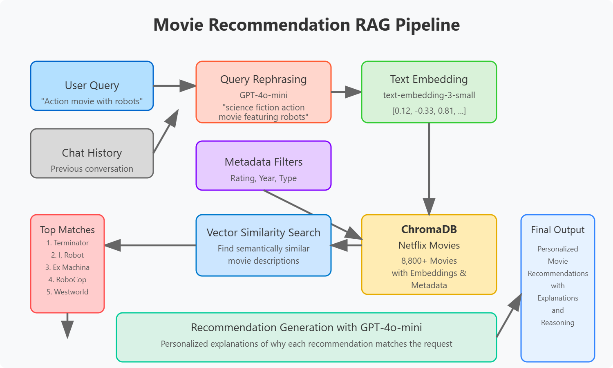

# Netflix Movie Recommendation Pipeline

## Overview

This document describes an end-to-end pipeline for building a semantic movie recommendation system using vector embeddings and retrieval-augmented generation (RAG). The system enables natural language search across Netflix content and provides personalized recommendations based on user preferences.

## Pipeline Architecture

## 1. Data Acquisition and Preparation

**Script: `1a_download_netflix_data.py`**

This script handles the initial data collection:
- Downloads the Netflix shows dataset from HuggingFace
- Extracts key fields: title, type, release year, rating, and description
- Handles missing values with appropriate defaults
- Saves structured data to `data/netflix_movies.json`
- Creates our foundation of ~8,800 movies and TV shows

## 2. Data Structuring and Separation

**Script: `1b_extract_movie_descriptions.py`**

This script prepares the data for embedding:
- Separates data into text descriptions (for embedding) and metadata (for filtering)
- Assigns unique identifiers to each movie entry (e.g., "movie_0")
- Creates two JSON files:
  - `data/movie_descriptions.json` for the text content
  - `data/movie_metadata.json` for structured attributes
- Optimizes the embedding process by focusing only on descriptive content

## 3. Vector Database Creation

**Script: `1c_store_movie_data.py`**

This script generates embeddings and creates the vector database:
- Establishes connection to OpenAI API using credentials from .env file
- Creates embeddings of movie descriptions using text-embedding-3-small model
- Processes in batches to manage API rate limits
- Stores three components in ChromaDB:
  - Embeddings: Vector representations of descriptions
  - Metadata: Structured attributes for filtering
  - Documents: Original text descriptions
- Creates a persistent vector database in the `./chroma_db` directory

## 4. RAG Implementation

**Script: `rag_retrieval.py`**

This script implements the recommendation system with several key functions:

1. **Query Rephrasing**: 
   - Uses GPT-4o-mini to incorporate conversation context
   - Makes ambiguous queries self-contained (e.g., "something like the one we discussed")

2. **Vector Retrieval**:
   - Converts queries to embeddings
   - Performs semantic search in ChromaDB
   - Applies metadata filters (rating, year, type)
   - Returns ranked results with similarity scores

3. **Recommendation Generation**:
   - Sends retrieved movies to GPT-4o-mini
   - Generates personalized explanations
   - Highlights why each movie matches the user's preferences

4. **Pipeline Integration**:
   - Combines all steps into a single callable function
   - Manages the entire process from query to recommendation

## 5. User Interface

**Script: `streamlit_app.py`**

A Streamlit web application that provides:
- Chat interface for natural language queries
- Sidebar filters for rating, release year, and content type
- Conversation history tracking
- Recommendation display with explanations

## Benefits and Applications

This pipeline provides several key advantages:

1. **Semantic Understanding**: Goes beyond keyword matching to understand concepts, themes, and mood
2. **Contextual Awareness**: Maintains conversation history to understand follow-up questions
3. **Personalization**: Provides recommendations with explanations specific to user preferences
4. **Flexibility**: Allows filtering by metadata like rating, year, and content type
5. **Natural Interaction**: Uses natural language for both input and output

## Requirements

- Python 3.7+
- Libraries: openai, chromadb, streamlit, python-dotenv, tqdm, datasets
- OpenAI API key (for embeddings and LLM generation)
- ~200MB disk space for database storage
